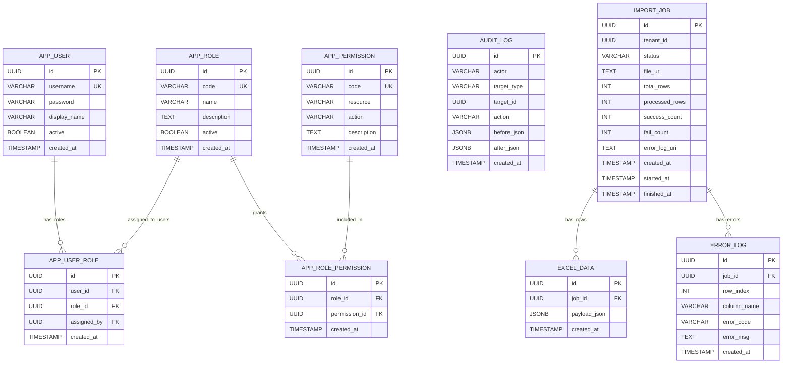
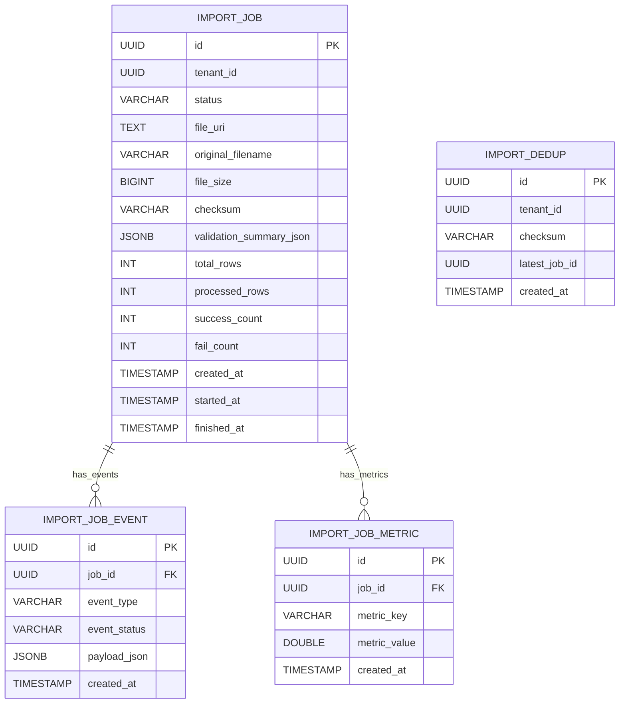

# ERD (As-Is / To-Be)

This document separates the current database model (As-Is) and the planned additions (To-Be).

## 1. As-Is (Currently Implemented)

### 1.1 Status
- Migration baseline: `V1` ~ `V6`
- `import_job.status` is `VARCHAR(32)` with a CHECK constraint
- Admin RBAC schema is implemented in `V6`

### 1.2 ERD (Current)

### 1.3 Indexes (Current)
- `idx_import_job_created` on `import_job(created_at DESC)`
- `idx_excel_data_job_created` on `excel_data(job_id, created_at DESC)`
- `idx_error_log_job_created` on `error_log(job_id, created_at DESC)`
- `idx_app_user_role_user` on `app_user_role(user_id)`
- `idx_app_user_role_role` on `app_user_role(role_id)`
- `idx_audit_log_target_created` on `audit_log(target_type, target_id, created_at DESC)`

---

## 2. To-Be (Planned Additions)

### 2.1 Admin Account Hardening (Next)
- Extend `app_user` with security lifecycle fields:
  - `password_changed_at`
  - `must_change_password`
  - `failed_login_count`
  - `locked_until`
  - `last_login_at`

### 2.2 Upload and Processing Extension (User)

### 2.3 Recommended Rollout Order
1. `app_user` security lifecycle columns
2. `import_job` metadata columns (`original_filename`, `file_size`, `checksum`)
3. event/metric tables (`import_job_event`, `import_job_metric`)
4. dedup policy table (`import_dedup`) and retry policy

---

## 3. Change Management Rules
- Apply To-Be tables with new Flyway migrations (`V7+`) in phases
- Keep backward compatibility for existing APIs
- Run migration rehearsal with sample data before production rollout
