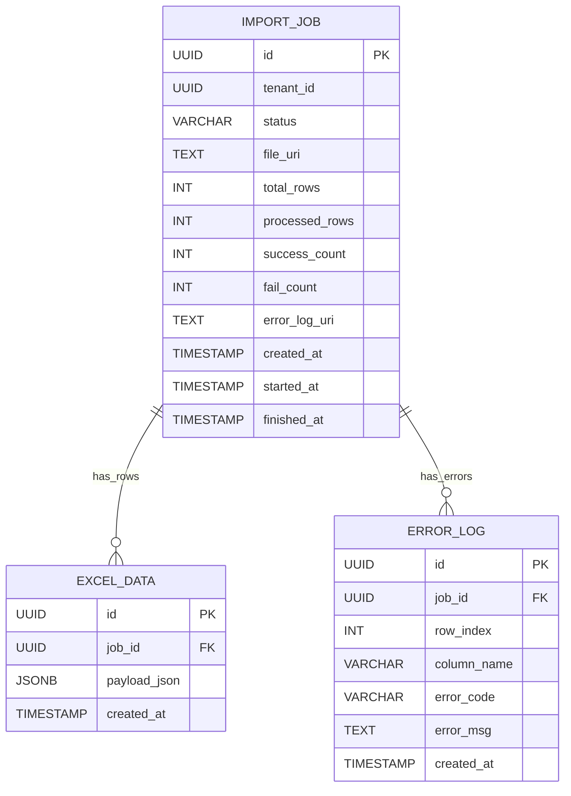
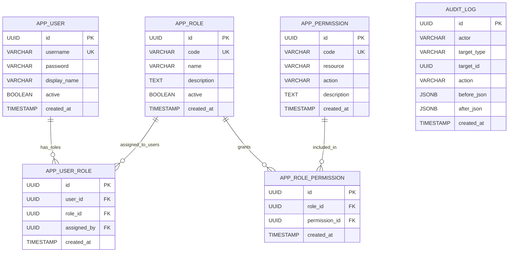

# ERD (2.5 Layer): Platform Admin + Workspace

이 문서는 `Admin/User 완전 분리` 대신, 초기 SaaS MVP에 맞는 `Workspace 중심 2.5계층` 모델로 정리한 ERD입니다.

## 1. Layer Definition

### 1.1 Platform Admin (내부 운영자)
- 결제/환불/제한 정책/장애 대응/지원/전체 모니터링
- 실제 고객 데이터의 업무 처리 권한은 최소화(지원 목적)

### 1.2 Workspace Owner (고객 관리자)
- 워크스페이스 대표 사용자(초기 기본 1명)
- 업로드/스키마 확정/실행 정책 결정의 주체
- 팀 플랜에서 멤버 초대/삭제 기능 확장 가능

### 1.3 Member (옵션)
- 초기에는 생략 가능
- 개인 서비스는 `Owner = Member`로 동작

---

## 2. As-Is Core ERD (현재 구현: admin-was V1~V6)

현재 DB 스키마는 `admin-was/src/main/resources/db/migration` 기준으로 아래와 같이 구현되어 있습니다.

### 2.1 Common Import Domain (As-Is)

상태값 제약(As-Is):
- `import_job.status`는 `VARCHAR(32)` + CHECK 제약
- 허용값: `CREATED`, `PARSING`, `VALIDATING`, `LOADING`, `COMPLETED`, `FAILED`

### 2.2 Admin RBAC Domain (As-Is)

### 2.3 As-Is 인덱스
- `idx_import_job_created` on `import_job(created_at DESC)`
- `idx_excel_data_job_created` on `excel_data(job_id, created_at DESC)`
- `idx_error_log_job_created` on `error_log(job_id, created_at DESC)`
- `idx_app_user_role_user` on `app_user_role(user_id)`
- `idx_app_user_role_role` on `app_user_role(role_id)`
- `idx_audit_log_target_created` on `audit_log(target_type, target_id, created_at DESC)`

### 2.4 As-Is 한계
- 고객 사용자 영역이 `app_user`(관리자 계정)와 분리되지 않음
- 고객 조직/워크스페이스 개념이 물리 스키마에 없음 (`tenant_id`만 존재)
- 요금제/플랜 권한(Entitlement) 모델 미구현
- 사용량 집계/쿼터 강제 모델 미구현
- DB 연결 보안(비밀키 참조/회전) 모델 미구현
- 스키마 확정 승인 주체(Owner/Admin) 정책 테이블 미구현

---

## 3. To-Be Core ERD (Workspace = 과금 단위)

핵심 원칙:
- `Workspace`는 권한 단위이면서 동시에 **과금 단위(Billing Unit)**
- MVP는 `OWNER/MEMBER` 역할 기반 단순 권한
- 제한은 플랜 + 사용량 집계로 강제

```mermaid
erDiagram
  PLATFORM_ADMIN {
    UUID id PK
    VARCHAR email UK
    VARCHAR password_hash
    VARCHAR display_name
    BOOLEAN active
    TIMESTAMP created_at
    TIMESTAMP last_login_at
  }

  WORKSPACE {
    UUID id PK
    VARCHAR slug UK
    VARCHAR name
    VARCHAR status
    UUID owner_account_id
    TIMESTAMP created_at
    TIMESTAMP updated_at
  }

  WORKSPACE_ACCOUNT {
    UUID id PK
    VARCHAR email UK
    VARCHAR password_hash
    VARCHAR display_name
    BOOLEAN active
    TIMESTAMP created_at
    TIMESTAMP last_login_at
  }

  WORKSPACE_MEMBERSHIP {
    UUID id PK
    UUID workspace_id FK
    UUID account_id FK
    VARCHAR role_code
    VARCHAR status
    TIMESTAMP joined_at
  }

  WORKSPACE_POLICY {
    UUID id PK
    UUID workspace_id FK
    VARCHAR schema_approval_mode
    BOOLEAN owner_auto_approve
    BOOLEAN allow_member_upload
    TIMESTAMP updated_at
  }

  WORKSPACE_FEATURE_FLAG {
    UUID id PK
    UUID workspace_id FK
    VARCHAR feature_code
    BOOLEAN enabled
    JSONB config_json
    TIMESTAMP updated_at
  }

  BILLING_PLAN {
    UUID id PK
    VARCHAR code UK
    VARCHAR name
    INT monthly_upload_quota
    BIGINT max_file_size_mb
    BOOLEAN active
  }

  PLAN_FEATURE {
    UUID id PK
    UUID billing_plan_id FK
    VARCHAR feature_code
    VARCHAR limit_unit
    INT limit_int
    BIGINT limit_bigint
    BOOLEAN limit_bool
    JSONB limit_json
  }

  WORKSPACE_SUBSCRIPTION {
    UUID id PK
    UUID workspace_id FK
    UUID billing_plan_id FK
    VARCHAR status
    BOOLEAN current_flag
    TIMESTAMP billing_cycle_anchor
    TIMESTAMP renewed_at
    TIMESTAMP canceled_at
    VARCHAR provider
    VARCHAR external_subscription_id
    TIMESTAMP started_at
    TIMESTAMP ended_at
  }

  WORKSPACE_USAGE_DAILY {
    UUID id PK
    UUID workspace_id FK
    DATE usage_day
    INT uploaded_files
    BIGINT processed_rows
    BIGINT failed_rows
    BIGINT storage_bytes
    INT job_count
    TIMESTAMP created_at
    TIMESTAMP updated_at
  }

  DB_CONNECTION {
    UUID id PK
    UUID workspace_id FK
    VARCHAR name
    VARCHAR db_type
    VARCHAR host
    INT port
    VARCHAR db_name
    VARCHAR username
    VARCHAR secret_ref
    VARCHAR ssl_mode
    VARCHAR password_enc
    INT key_version
    TIMESTAMP created_at
    TIMESTAMP updated_at
  }

  IMPORT_JOB {
    UUID id PK
    UUID workspace_id FK
    UUID requested_by_account_id
    VARCHAR status
    TEXT file_uri
    VARCHAR original_filename
    BIGINT file_size
    VARCHAR checksum
    INT total_rows
    INT processed_rows
    INT success_count
    INT fail_count
    TIMESTAMP created_at
    TIMESTAMP started_at
    TIMESTAMP finished_at
  }

  IMPORT_DEDUP {
    UUID id PK
    UUID workspace_id FK
    VARCHAR checksum
    BIGINT file_size
    UUID latest_job_id
    TIMESTAMP created_at
  }

  IMPORT_JOB_RUN {
    UUID id PK
    UUID job_id FK
    INT run_no
    VARCHAR worker_id
    VARCHAR status
    TIMESTAMP started_at
    TIMESTAMP finished_at
    TEXT error
  }

  IMPORT_JOB_EVENT {
    UUID id PK
    UUID job_id FK
    VARCHAR event_type
    VARCHAR level
    JSONB payload_json
    TIMESTAMP created_at
  }

  IMPORT_JOB_METRIC {
    UUID id PK
    UUID job_id FK
    VARCHAR metric_key
    DOUBLE metric_value
    TIMESTAMP created_at
  }

  EXCEL_DATA {
    UUID id PK
    UUID job_id FK
    JSONB payload_json
    TIMESTAMP created_at
  }

  ERROR_LOG {
    UUID id PK
    UUID job_id FK
    INT row_index
    VARCHAR column_name
    VARCHAR error_code
    TEXT error_msg
    TIMESTAMP created_at
  }

  APPROVAL_REQUEST {
    UUID id PK
    UUID workspace_id FK
    UUID job_id
    VARCHAR request_type
    VARCHAR status
    UUID requested_by_account_id
    TIMESTAMP created_at
  }

  APPROVAL_DECISION {
    UUID id PK
    UUID approval_request_id FK
    UUID decided_by_account_id
    VARCHAR decision
    TEXT reason
    TIMESTAMP decided_at
  }

  WORKSPACE ||--o{ WORKSPACE_MEMBERSHIP : has_members
  WORKSPACE_ACCOUNT ||--o{ WORKSPACE_MEMBERSHIP : belongs_to
  WORKSPACE ||--|| WORKSPACE_POLICY : has_policy
  WORKSPACE ||--o{ WORKSPACE_FEATURE_FLAG : has_flags

  BILLING_PLAN ||--o{ PLAN_FEATURE : includes
  WORKSPACE ||--o{ WORKSPACE_SUBSCRIPTION : subscribed_by
  BILLING_PLAN ||--o{ WORKSPACE_SUBSCRIPTION : selected_plan
  WORKSPACE ||--o{ WORKSPACE_USAGE_DAILY : tracks_usage

  WORKSPACE ||--o{ DB_CONNECTION : owns_connections

  WORKSPACE ||--o{ IMPORT_JOB : owns_jobs
  WORKSPACE ||--o{ IMPORT_DEDUP : dedup_scope
  IMPORT_JOB ||--o{ IMPORT_JOB_RUN : has_runs
  IMPORT_JOB ||--o{ IMPORT_JOB_EVENT : has_events
  IMPORT_JOB ||--o{ IMPORT_JOB_METRIC : has_metrics
  IMPORT_JOB ||--o{ EXCEL_DATA : has_rows
  IMPORT_JOB ||--o{ ERROR_LOG : has_errors

  WORKSPACE ||--o{ APPROVAL_REQUEST : creates
  APPROVAL_REQUEST ||--o{ APPROVAL_DECISION : has
```

---

## 4. To-Be 제약/인덱스 가이드 (실무 포인트)

### 4.1 Unique/Key
- `workspace_membership(workspace_id, account_id)` UK
- `workspace_feature_flag(workspace_id, feature_code)` UK
- `workspace_usage_daily(workspace_id, usage_day)` UK
- `import_job_run(job_id, run_no)` UK
- `import_dedup(workspace_id, checksum, file_size)` UK
- `workspace_account(lower(email))` UK (또는 `citext`)
- `workspace(slug)` UK
- `billing_plan(code)` UK

### 4.2 Index
- `import_job(workspace_id, created_at DESC)`
- `excel_data(job_id, created_at DESC)`
- `error_log(job_id, row_index)`
- `workspace_subscription(workspace_id, started_at DESC)`
- `approval_request(workspace_id, created_at DESC)`

### 4.3 CHECK 권장
- `workspace.status`
- `workspace_subscription.status`
- `import_job.status`
- `import_job_run.status`
- `approval_request.status`
- `approval_decision.decision`
- `schema_approval_mode`

---

## 5. MVP 운영 규칙 (초기)

- `Workspace` 생성 시 `Owner` 1명 자동 생성
- `Member` 기능은 feature flag로 비활성화 가능
- 스키마 확정 주체는 `workspace_policy.schema_approval_mode`로 제어
  - `OWNER`
  - `PLATFORM_ADMIN`
  - `DUAL_APPROVAL`
- 권한/제한 분리:
  - 권한: `membership.role_code` (`OWNER`, `MEMBER`)
  - 제한: `plan_feature` + `workspace_usage_daily`

Reserved(v2+):
- `workspace_role`
- `workspace_permission`
- `workspace_role_permission`

---

## 6. As-Is -> To-Be Migration 방향

1. 기존 `app_user` 중심 관리 기능을 `platform_admin`(내부) / `workspace_account`(고객)로 분리
2. `import_job.tenant_id`를 `workspace_id`로 의미 전환(단계적 마이그레이션)
3. `workspace_membership` 도입 후 Owner 1인 구조부터 적용
4. 멤버 초대/삭제, 승인 워크플로우, 고급 모니터링 순으로 확장

---

## 7. 권장 Flyway 커밋 단위 (리소스 분배 전략)

- `V7`: `workspace`, `workspace_account`, `workspace_membership`, `import_job.workspace_id` 전환
- `V8`: `billing_plan`, `plan_feature`, `workspace_subscription`, `workspace_usage_daily`
- `V9`: `db_connection(secret_ref 중심)`
- `V10`: `import_job_run`, `import_job_event`, `import_job_metric`, `import_dedup`
- `V11`: `approval_request`, `approval_decision`, `workspace_feature_flag`

---

## 8. 왜 2.5 계층이 맞는가

- 초기 복잡도를 낮추면서도 확장 포인트를 보존
- 고객 관점에서 `Workspace`만 이해하면 되는 단순 UX
- 내부 운영(Platform Admin)과 고객 업무(Owner/Member) 경계를 명확히 유지
- 보안/비용/신뢰성/릴리즈 전략을 데이터 모델에서 직접 표현 가능