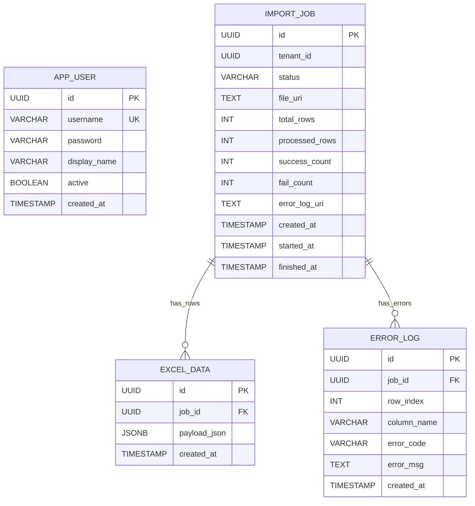
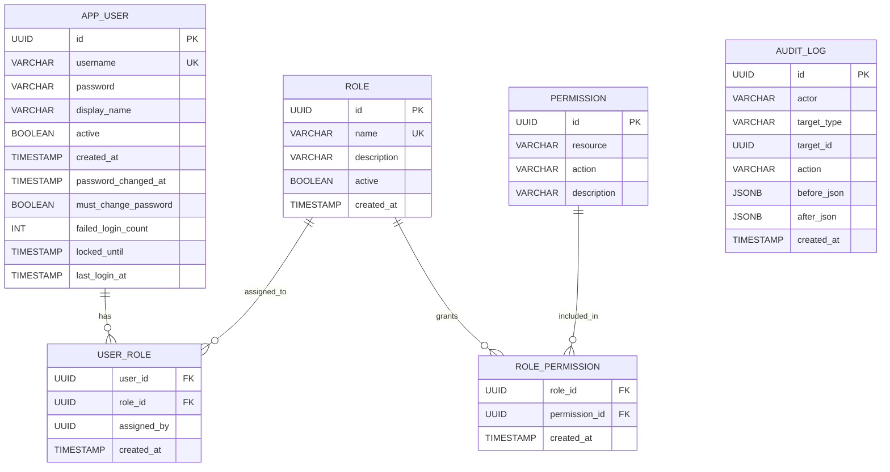
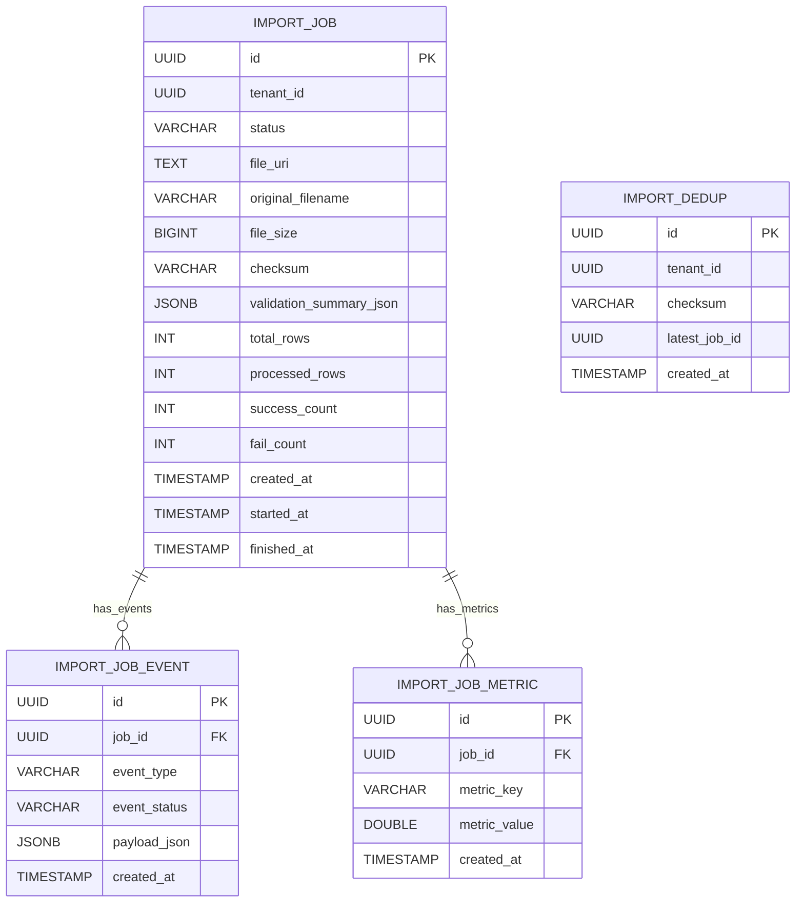

# ERD (As-Is / To-Be)

This document separates the current database model (As-Is) and the planned additions (To-Be).

## 1. As-Is (Currently Implemented)

### 1.1 Status
- Migration baseline: `V1` ~ `V5`
- `import_job.status` is now `VARCHAR(32)` with a CHECK constraint

### 1.2 ERD (Current)

### 1.3 Indexes (Current)
- `idx_import_job_created` on `import_job(created_at DESC)`
- `idx_excel_data_job_created` on `excel_data(job_id, created_at DESC)`
- `idx_error_log_job_created` on `error_log(job_id, created_at DESC)`

---

## 2. To-Be (Planned Additions)

> The model below is proposed from:
> - `admin-was/docs/ADMIN_ENHANCEMENT_PLAN.md`
> - `user-was/docs/USER_ENHANCEMENT_PLAN.md`
> and is not implemented yet.

### 2.1 Authorization and User Management Extension (Admin)

### 2.2 Upload and Processing Extension (User)

### 2.3 Recommended Rollout Order
1. Authorization model (`role`, `permission`, `user_role`, `role_permission`) + `audit_log`
2. Extend `import_job` (`original_filename`, `file_size`, `checksum`)
3. Add event/metric tables (`import_job_event`, `import_job_metric`)
4. Add dedup policy table (`import_dedup`) and retry policy

---

## 3. Change Management Rules
- Apply To-Be tables with new Flyway migrations (`V6+`) in phases
- Keep backward compatibility for existing APIs
- Run migration rehearsal with sample data before production rollout