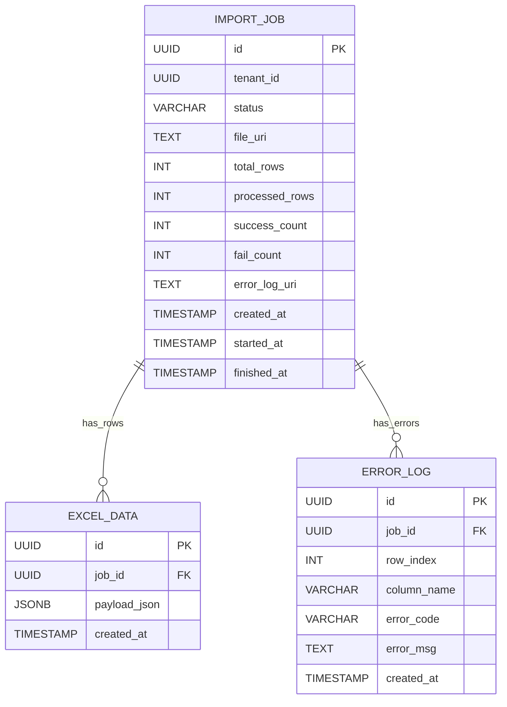
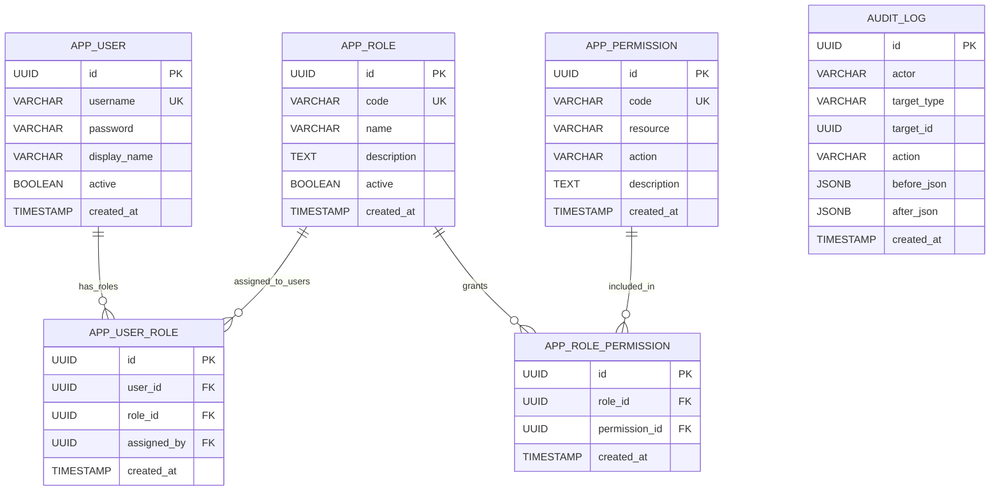
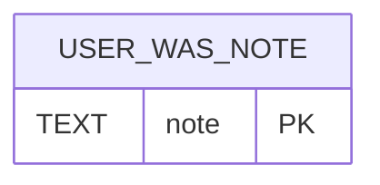
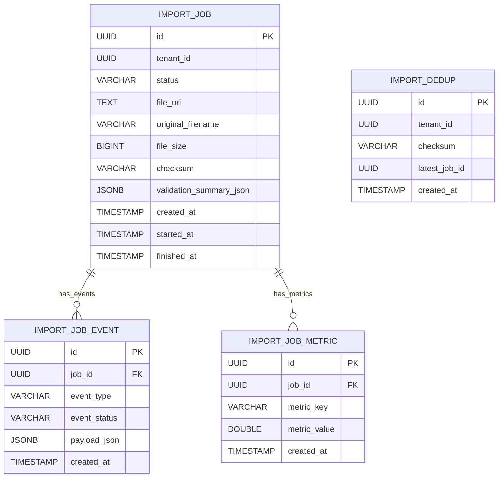

# ERD by Layer (Common / Admin / User)

This document groups the current and planned schema by service layer so ownership is clear.

---

## 1. Layer Map

### 1.1 Common Layer (shared domain)
- `import_job`
- `excel_data`
- `error_log`

### 1.2 Admin Layer (`admin-was`)
- `app_user`
- `app_role`
- `app_permission`
- `app_user_role`
- `app_role_permission`
- `audit_log`

### 1.3 User Layer (`user-was`)
- (current) no dedicated user-account table yet
- (planned) `tenant_user`, plus schema/approval flow tables

---

## 2. As-Is (Implemented: V1 ~ V6)

### 2.1 Common Layer ERD

### 2.2 Admin Layer ERD

### 2.3 User Layer ERD (As-Is)

- User layer currently reuses common tables with tenant scope.
- Dedicated end-user identity table is not implemented yet.

### 2.4 As-Is Indexes
- Common:
  - `idx_import_job_created` on `import_job(created_at DESC)`
  - `idx_excel_data_job_created` on `excel_data(job_id, created_at DESC)`
  - `idx_error_log_job_created` on `error_log(job_id, created_at DESC)`
- Admin:
  - `idx_app_user_role_user` on `app_user_role(user_id)`
  - `idx_app_user_role_role` on `app_user_role(role_id)`
  - `idx_audit_log_target_created` on `audit_log(target_type, target_id, created_at DESC)`

---

## 3. To-Be (Planned)

### 3.1 Common Layer (Planned Extensions)

### 3.2 Admin Layer (Planned Extensions)
- Extend `app_user` with security lifecycle fields:
  - `password_changed_at`
  - `must_change_password`
  - `failed_login_count`
  - `locked_until`
  - `last_login_at`
- Add approval governance entities:
  - `approval_request`
  - `approval_decision`

### 3.3 User Layer (Planned Extensions)
- Add dedicated identity:
  - `tenant_user`
  - `tenant_user_role` (optional if user-side RBAC needed)
- Add schema draft lifecycle entities:
  - `dataset`
  - `dataset_version`
  - `schema_draft`
  - `schema_column_draft`

---

## 4. Ownership and Rollout Order

### 4.1 Ownership
- Common Layer: shared by both WAS modules, schema controlled by admin migrations
- Admin Layer: owned by `admin-was`
- User Layer: owned by `user-was` (once dedicated tables are introduced)

### 4.2 Rollout
1. Admin/user account domain split (`app_user` vs `tenant_user`)
2. Approval mode policy (`SELF_APPROVAL`, `ADMIN_APPROVAL`, `DUAL_APPROVAL`)
3. Schema draft + approval tables
4. DDL planning/execution and ERD export pipeline

---

## 5. Migration Rule
- Use phased Flyway migrations (`V7+`) with backward compatibility.
- Rehearse with sample data before production rollout.
